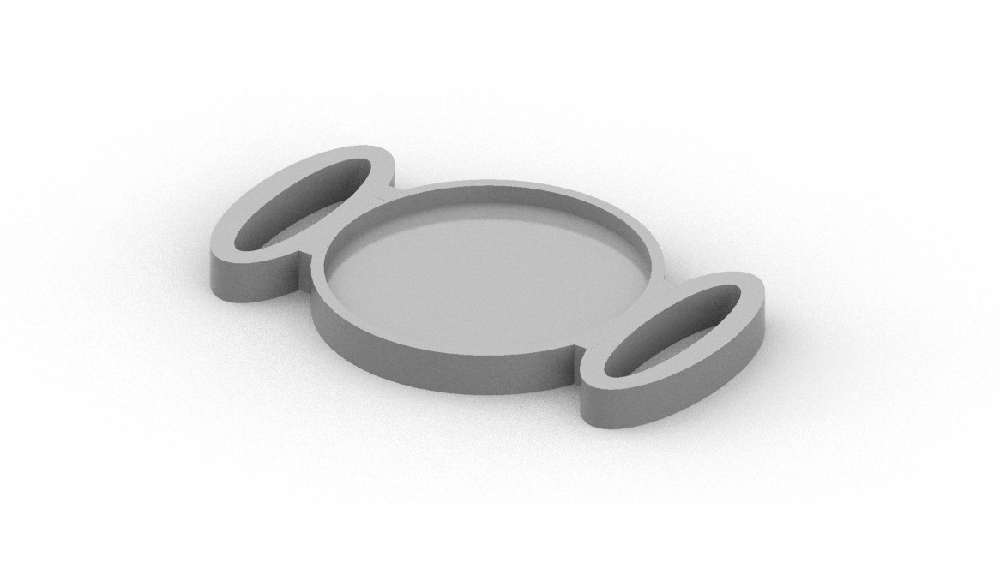

# Personal Locker
Разработка и производство с помощью цифровых машин дверцы для персонального RFID-локера и аксессуара для RFID-метки

## Фиксация дверцы

*Оборудование - 3D-принтер Prusa i3 MK3*

*Материал и крепежные изделия - PLA (полилактид), болты М4 30-35мм, гайки М4, шайбы*

*Программное обеспечение - PrusaSlicer*

*3D-Модель - [Thingiverse](https://www.thingiverse.com/thing:2401035)*

**Процесс 3D-печати**

https://github.com/Darya-Akhiyarova/-/assets/144244924/0e7b2e56-13f5-49ba-9851-f7a6a8de2faf

Рис.1 - Напечатанные на 3D-принтере детали дверной петли

Для фиксации двери стеллажа было собрано две одинаковые шарнирные петли.

## Производство двери

### Определение размеров и раскрой фанеры

*Оборудование - Фрезерный станок FlexiCAM, шлифовальная машинка*

*Материал - Листовая фанера 6мм"

*Программное обеспечение -  ArtCAM*

Для установки двери внахлест к полке стеллажа определены следующие размеры: 

*высота - 35мм, ширина - 44мм*

**Процесс фрезерной резки**

https://github.com/Darya-Akhiyarova/-/assets/144244924/6e0c3629-cc6f-4ea8-bdb3-af8c0c77be27

После раскроя дверца была обработана по краям шлифовальной машинкой

### Индексация локера

*Оборудование - Лазерный гравер Trotec Speedy400 flexx*

*Материал - Листовая фанера 3мм, баллончик с краской*

*Программное обеспечение -  CorelDraw, Trotec JobControl*

С помощью лазерной резки был изготовлен трафарет цифры для последующего распыления краски.

Рис.2 - Нанесение номера с помощью трафарета

На двери под цифрой на определенном расстоянии были выгравированы, также с помощью лазера, фамилия и имя.

Рис.3 - Нанесенная гравировка

### Тестирование дверцы

Дверца и доска (имитация стенки стеллажа) были зафиксированы петлей с помощью саморезов, чтобы проверить функицональность конструкции.

**Тестирование**

https://github.com/Darya-Akhiyarova/-/assets/144244924/50d19d83-fd06-44a5-ae87-b20a3b184d02

## Разработка RFID-аксессуара

*Оборудование - 3D-принтер Prusa i3 MK3*

*Материал - Flex (пластик)*

*Программное обеспечение - Rhinoceros 6, PrusaSlicer*

Для личного удобства был разработан дизайн аксессуара "чебупряжка" (название получино из-за формы) на фитнес-браслет. 

Рис.4 - 3D-модель чебупряжки

Как можно заметить из рисунка 4, у модели имеется место в центре для круглой RFID-метки и ушки для фиксации аксессуара на ремешке фитнес-браслета.
Материал был подобран, исходя из пластичных свойств пластика Flex. В случае надобности, его прочность позволяет использовать чебупряжку как брелок.

Рис.5 - Готовая чебупряжка с RFID-меткой

Рис.6 - Вид аксессуара на браслетебраслете

## Установка замка

*Оборудование - 3D-принтер Prusa i3 MK3, паяльник, шуруповерт*

*Материал - PLA, цианокрилатный клей, саморезы, медные провода, термоусадочные трубки, изолента*

*Программное обеспечение - PrusaSlicer*

Необходим длинный провод, чтобы было возможно подключить соленоид к плате. Для этого были спаяны между собой медные провода и присоединены к соленоиду.

**ВАЖНО ИЗОЛИРОВАТЬ ПРОВОДА ДРУГ ОТ ДРУГА** 

Рис.7 - Элементы сборки (фиксирующий замок с соленоидом, провод) 

Рис.8 - Провода, подключенные к плате

Рис.9 - Установленный на дверь замок

Недочеты:

- Слабое крепление петель к фанере (маленькие саморезы, расширенные отверстия для крепежа) из-за чего дверь провисает
- Неаккуратная изоляция проводов
